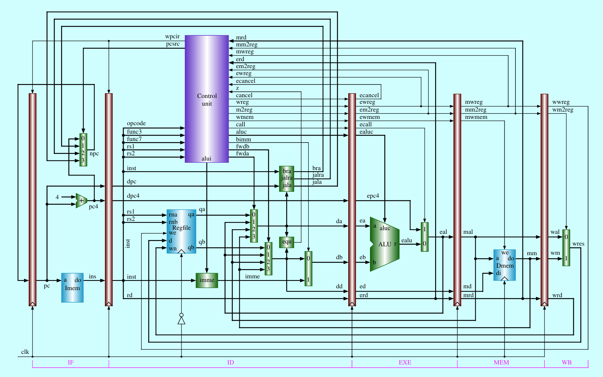

# Pipelined-CPU
A 5-stage pipeline CPU based on RISC-V instruction datasets

Table of Contents
=================

* [Directory Structure](#directory-structure)
* [CPU Design](#cpu-design)
* [Hazard Handling](#hazard-handling)

# Directory Structure
<pre>
├── CPU(pl_computer.v)
│   ├── pl_reg_pc.v
│   ├── pl_stage_if.v  
│   │   ├── pc4.v
│   │   ├── mux4x32.v
│   │   ├── pl_instmem.v
│   ├── pl_reg_ir.v
│   ├── pl_stage_id.v
│   │   ├── regfile.v
│   │   ├── branch_addr.v
│   │   ├── jal_addr.v
│   │   ├── jalr_addr.v
│   │   ├── equ.v
│   │   ├── imme.v  
│   │   ├── mux2x32.v
│   │   ├── mux4x32.v
│   │   ├── pl_cu.v
│   ├── pl_reg_de.v
│   ├── pl_stage_exe.v
│   │   ├── alu.v
│   │   ├── mux2x32.v
│   ├── pl_reg_em.v
│   ├── pl_stage_mem.v
│   │   ├── pl_datamem.v
│   ├── pl_reg_mw.v
│   ├── pl_stage_wb.v  
│   │   ├── mux2x32.v
</pre>

# CPU Design

- 32-bit computing  
- Transformed from the single-cycle CPU to a pipelined architecture
- Design is based on the RISC-V instruction set architecture (ISA)
- The CPU utilizes hardware-based hazard handling
- Reference : Yamin Li. Computer Organization and Design. Lecture presented at Hosei University, Fall 2023. Retrieved from https://yamin.cis.k.hosei.ac.jp/lectures/cod/

# Hazard Handling
## Structural Hazard
- Divided the memory into instruction memory and data memory
- Separated the register file into write port and read port
## Control Hazard
- Moved the branch address acquisition (mux4x32.v) to the IF stage
- Separated the zero flag from the ALU and created a new module to calculate whether rs1 equal to rs2 (equ.v), moving it to the ID stage
## Data Hazard
- Utilizing forwarding(By-Pass), pre-fetching data from registers between stages to be ahead of the ALU input
- Applying Stall Hardware to stall the pipeline for one cycle when a load-use data hazard occurs

